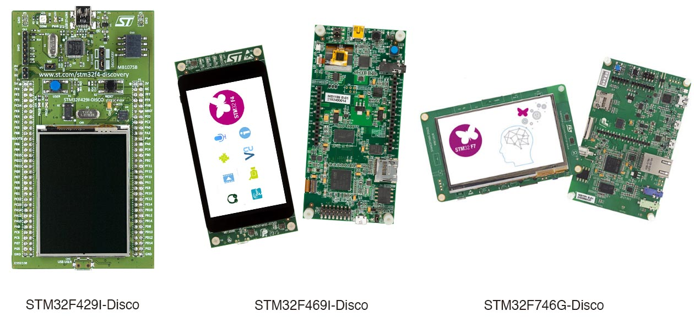

# Presentation of this tutorial
 
This tutorial shows how to adapt and configure a Ravenscar
run-time library (Full or SFP) for a MCU/board that is not
already supported by your GNAT compiler.

To do so, we will use GNAT GPL for ARM ELF and 3 boards of the same family: the
STM32F429I-Discovery, the STM32F469I-Discovery, and the STM32F746G-Discovery
from STMicroeletronics.

These boards are interesting because:

 * They're fun to use, with lots of components to play with (exact features
   depends on the board): LCD, touch panel, audio in/out, SD-Card support,
   Networking, etc.
 * They are pretty cheap.
 * They are from the same manufacturer, so we can expect some reuse in terms of
   drivers.
 * The first one (STM32F429I-Disco) is already supported by default by the GNAT
   run-time. We can start from there to add support for the other boards.
 * They differ enough to deserve specific run-time adjustments, while sharing
   the same architecture (ARMv7) and DSP/FPU (Cortex-M4 & M7)

So where to start ? First, we need to understand what is MCU-specific, and what
is board-specific:

 * Instructions, architecture are MCU specific. GCC is configured to
   produce code that is compatible with a specific architecture. This
   also takes into account specific floating point instructions when
   they are supported by the hardware.
 * Initialization of an MCU is specific to a family (All STM32F4 share
   the same code, the F7 will need adjustments).
 * The interrupts are MCU-specific, but their number and assignments
   vary from one minor version to another depending on the features
   provided by the MCU.
 * Memory mapping is also MCU-specific. However there are differences
   in the amount of available memory depending on the exact version of
   the MCU (e.g. this is not a property of the MCU family). This
   concerns the in-MCU memory (the SRAM), not the potential external
   SDRAM memory that depends on the board.
 * Most clock configuration can be made board-independant, using the
   MCU's HSI clock (High Speed Internal clock), however this is in
   general not desirable, as external clocks are much more
   reliable. Configuring the board and MCU to use the HSE (High Speed
   External clock) is thus recommended, but board-specific.

From this list, we can deduce that - if we consider the CPU
architecture stable, which is the case here - adapting the run-time to
a new board mainly consists in:

 * Adapting the startup code in case of a major MCU version (STM32F7, that is
   Cortex-M7 based).
 * Checking and defining the memory mapping for the new MCU.
 * Checking and defining the clock configuration for the specific board.
 * Make sure that the hardware interrupts are properly defined and handled.

[Next](2_ENVIRONMENT.md) - [Home](README.md)
