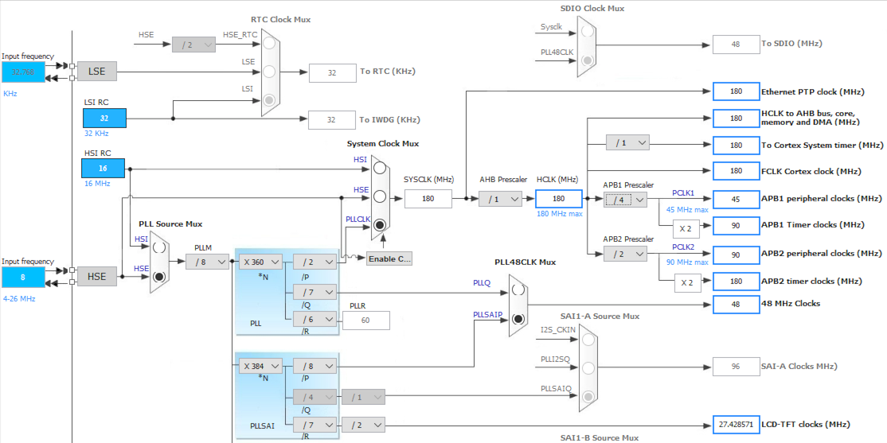

# Handling the STM32F469I-Discovery

Having seen how to build a run-time library in the previous tutorial step,
now we turn to to making actual modifications.

Let's start with the support of the STM32F469I-Discovery. This is a good
target for illustration because it is very similar to the STM32F429I, so
the necessary modifications to the run-time are less intrusive than, for
example, the modifications for the STM32F7.

## Memory mapping and linker scripts

In this step, we're going to tell the linker at what addresses we must
put stuff. This is done by editing the
`arm/stm32/mystm32/memory-map.ld` script.

For this, we need to find the technical documents that describe the
MCU. Go to http://st.com and search for "stm32f469NI" (that is the MCU
used by the discovery board), and once in the product page, click on
"design resources" and check the [RM0386 Reference Manual](https://www.st.com/st-web-ui/static/active/en/resource/technical/document/reference_manual/DM00127514.pdf).

From chapter 2.3.1, we learn that we have a total of 384kB of
SRAM, including 64kB of CCM (Core Coupled Memory) at 0x1000 0000 and
the remaining at 0x2000 0000.

Additionally, we need to check the flash size. This is MCU version specific.
The particular MCU on the STM32F469-Disco board has 2 MB of flash. The STM32
reference manual tells us that this flash is addressed at 0x0800 0000.

Armed with this information, we can now edit the
memory-map.ld file so that it looks like this:

```
MEMORY
{
  flash (rx)  : ORIGIN = 0x08000000, LENGTH = 2048K
  sram  (rwx) : ORIGIN = 0x20000000, LENGTH = 320K
  ccm   (rw)  : ORIGIN = 0x10000000, LENGTH = 64K
}
```

## Bindings and Interrupt handling

On the STM32 targets we can benefit from svd2ada and the CMSIS-SVD description
files to generate automatically the bindings for the new MCU.

See the environment setup on how to get svd2ada.

In the specific case of the STM32F469 board, svd2ada comes with the proper
SVD file already. To use it to generate the code, you need to

1. go to the MCU folder in bb-runtimes
2. generate the svd bindings

So let's do that:

```
$ export SVD2ADA=<path_to_svd2ada>
$ cd bb-runtimes/arm/stm32/mystm32
$ rm -rf svd
$ $(SVD2ADA)/svd2ada $(SVD2ADA)/CMSIS-SVD/ST/STM32F46_79x.svd -o svd -p Interfaces.STM32
```

svd2ada will generate two sets of files:

 * i-stm32*: bindings to the peripherals
 * a-intnam.ads and handler.S: support for the MCU's interrupts

Note that the support for interrupts are generated only when the Interfaces
package hierarchy is used.

With the above step, most of the support for interrupts is already implemented
in your run-time. You can check those files, and in particular verify that
on this MCU, the Interrupt IDs range from -1 to 92.

To finalize the support, you need to edit `s-bbmcpa.ads` and specify that the
number of interrupts is now 92.

```ada
   Number_Of_Interrupts : constant := 92;
```

## System clocks

The run-time is responsible for initializing the system clock. To configure
this aspect we need to know the various clock settings that
are available, and the main clock source.

STMicroelectonics provides a tool to help set up their MCU targets:
[STM32CubeMX](http://www.st.com/web/en/catalog/tools/FM147/CL1794/SC961/SS1533/PF259242). Using the tool we can verify the clock settings:



To properly setup the values, we now need to check the speed of the
HSE clock on the board. So go back to st.com, search for STM32F469-Disco,
and from the product page, download the board's user manual [UM1932:
Discovery kit with STM32F469NI
MCU](http://www.st.com/st-web-ui/static/active/en/resource/technical/document/user_manual/DM00218846.pdf).
From chapter "6.3.1 HSE clock source" check that the HSE clock is
running at 8MHz.

Now let's check that the run-time is doing the right thing:

* `setup_pll.adb`: this file is responsible for the board setup. Normally you
  shouldn't have to modify it. It relies on two packages:

  * `s-bbpopa.ads`: board-specific parameters (in particular clocks)
  * `s-bbmcpa.adb`: PWR peripheral setup

First let's check the clock constants in `s-bbbopa.ads`:

```ada
   Main_Clock_Frequency : constant := 168_000_000;
   --  Optimal frequency of the system clock. Note that the STM32F411 can go
   --  up to 200 MHz, but all other STM32F40x and STM32F41x MCUs can only do
   --  168 MHz.

   HSE_Clock_Frequency : constant := 8_000_000;
   --  Frequency of High Speed External clock.

   FLASH_Latency : constant := 5;
   PLLP_Value    : constant := 2;
   PLLQ_Value    : constant := 7;
```

The HSE is OK (the STM32F469I-Discovery board has a 8MHz
crystal). However the Clock_Frequency constant can be bumped to
180 MHz on this MCU.

   Main_Clock_Frequency : constant := 180_000_000;

Looking now at setup_pll.adb, we can verify that this file does not
require specific changes. PLLM is set to 8 to achieve a 1 MHz input
clock. PLLP is already set to 2 in `s-bbbopa.ads`, so PLLN is
evaluated to 360 to achieve the expected clock speed : HSE / PLLM *
PLLN / PLLP = 180 MHz.

## PWR peripheral and Overdrive

Now on to power management: the file `s-bbmcpa.adb` handles the
PWR peripheral initialization.

The STM32F469 has more capabilities than the base STM32F40x MCU.
In particular it allows Overdrive. This requires the PWR module to run at
full Voltage.

So we'll adjust `s-bbmcpa.adb`:

```diff
@@ -45,7 +45,7 @@
    begin
       --  Set the PWR to Scale 1 mode to stabilize the MCU when in high
       --  performance mode.
-      PWR_Periph.CR.VOS := 1;
+      PWR_Periph.CR.VOS := 3;
    end PWR_Initialize;

    --------------------------
@@ -55,7 +55,18 @@
    procedure PWR_Overdrive_Enable
    is
    begin
-      null;
+      --  Enable the overdrive mode
+      PWR_Periph.CR.ODEN := 1;
+      --  Wait for stabilisation
+      loop
+         exit when PWR_Periph.CSR.ODRDY = 1;
+      end loop;
+
+      --  Now switch to it
+      PWR_Periph.CR.ODSWEN := 1;
+      loop
+         exit when PWR_Periph.CSR.ODSWRDY = 1;
+      end loop;
    end PWR_Overdrive_Enable;

 end System.BB.MCU_Parameters;
```

## And that's it

The necessary changes have now been made to support the
STM32F469I-Disco. You can now install the run-time like so:

```
$ cd bb-runtimes
$ ./build_rts.py --bsps-only --output=build --prefix=arm-eabi/lib/gnat --link mystm32
$ gprbuild -P build/BSPs/ravenscar_sfp_mystm32.gpr
$ gprinstall -f -p -P build/BSPs/ravenscar_sfp_mystm32.gpr --prefix=./runtimes
```

You can also test it out with the [Ada Drivers
Library](https://github.com/AdaCore/Ada_Drivers_Library) demos:

```
$ gprbuild -p -P balls_demo.gpr -XBOARD=STM32F469-DISCO -XRTS=ravenscar-sfp -XLCH=lcd -XLOADER=ROM --RTS=~/bb-runtimes/build/runtimes/ravenscar-sfp-mystm32
$ arm-eabi-objcopy -O binary obj/demo obj/demo.bin
$ st-flash write obj/demo.bin 0x8000000
```

To check your work, you can also compare your `mystm32` directory with
the `stm32f469x` that provides already support for the same board.

[Next](4_STM32F7.md) - [Home](README.md)
