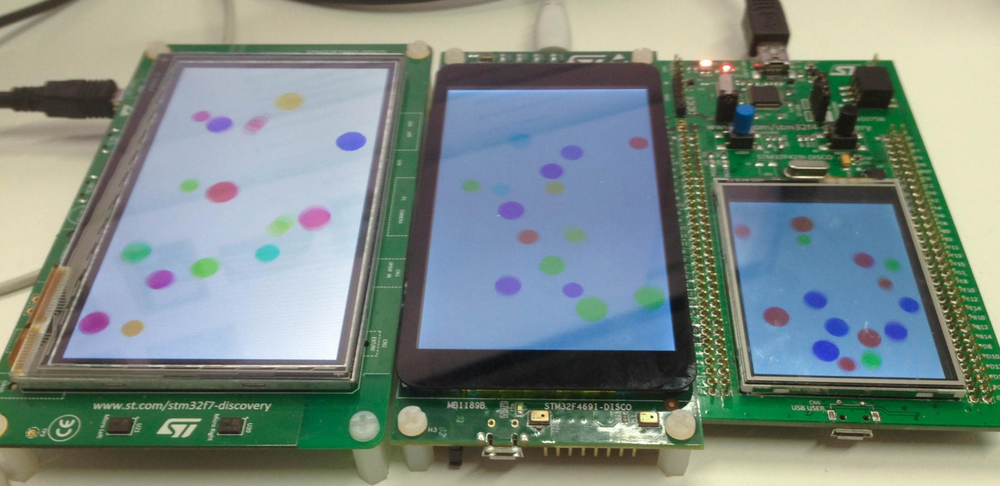

# Conclusion and refinements

In conclusion, don't hesitate to navigate in bb-runtimes and examine
the files to understand how board variations and specifics are handled by the
BSPs.

To go further in customized run-time libraries, refer to the following
documentation: [Customized
run-time](https://docs.adacore.com/gnat_ugx-docs/html/gnat_ugx/gnat_ugx/customized_run-time_topics.html).

Also, having a run-time library is not enough to achieve a complete application
on a board: you'll also need to control the various peripherals that are
there. You can checkout our [Ada Drivers
Library](https://github.com/AdaCore/Ada_Drivers_Library) to see if the
peripheral support is already provided, or at least get inspiration for
how to write your own driver.

[Home](README.md)
