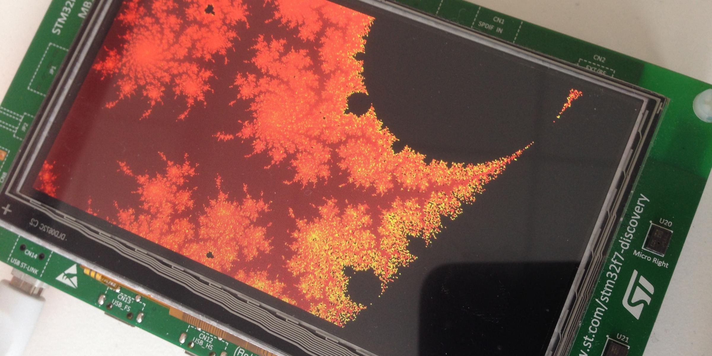

# Porting the Ada Runtime to a new ARM board

This guide is a tutorial on how to port the Ada run-time to boards that are not
supported by default with the GNAT compiler.

It will detail the process of using the base stm32f4 run-time to generate
a better support for the stm32f469-discovery and stm32f746-discovery boards.

It is meant as a starting point to the more generic question on how to adapt
the GNAT runtimes to a specific board.

 1. [Introduction](1_INTRO.md)
 2. [Preparing your environment](2_ENVIRONMENT.md)
 3. [Handling the STM32F469I-Discovery](3_STM32F469.md)
 4. [Porting the run-time to the STM32F7-DISCOVERY](4_STM32F7.md)
 5. [Final words and refinements](5_CONCLUSION.md)
